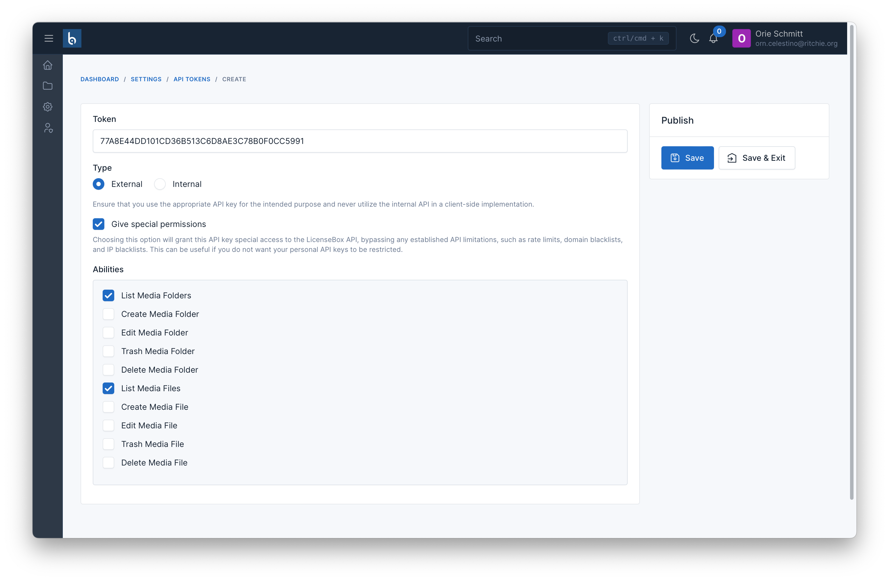

# API Integration

## Available Endpoints

- List Media Folders
- Create Media Folder
- Edit Media Folder
- Trash Media Folder
- Delete Media Folder
- List Media Files
- Create Media File
- Edit Media File
- Trash Media File
- Delete Media File

For more details, you can see more on [Postman](https://documenter.getpostman.com/view/11116730/2sA3JQ3ejZ).

## Create API Token

To use the available APIs for interacting with Media Files or Media Folders such as retrieving lists, creating, or deleting, you need an authentication token. To generate this token, you access the page `Settings` -> `API Tokens` -> `Create`.

The **Token** field is automatically generated, but you can change it if needed

The **Type** field has two options: **External** and **Internal**. Internal is used when you are using the API within your organization, while External is for allowing access to users outside your organization or customers.

The **Give special permissions** field, by default unchecked, grants the token all the permissions that Cloudify supports as listed in the Available Endpoints section.



If you want the token to have access to only specific permissions, you can check the **Give special permissions** field and select the permissions that the token should have access to.

## Upload File Example

In the following example, we will learn how to integrate the Cloudify API to upload files using Laravel.

### Step 1: Create the Upload Form

First, create a view file to display a form that allows users to select a file to upload. Save this file as `resources/views/upload.blade.php`:

```blade
@error('file')
    <p style="color: red">{{ $message }}</p>
@enderror

@if(session('success'))
    <p style="color: green">URL: <code>{{ session('success') }}</code></p>
@endif

<form action="{{ route('upload') }}" method="post" enctype="multipart/form-data">
    @csrf

    <input type="file" name="file" />
    <button type="submit">Upload</button>
</form>
```

### Step 2: Create the Controller

Next, create an `UploadController` to render the view and handle the logic to send the file to the API. Save this file as `app/Http/Controllers/UploadController.php`:

```php
use Illuminate\Http\Request;
use Illuminate\Support\Arr;
use Illuminate\View\View;
use Illuminate\Http\RedirectResponse;

class UploadController extends Controller
{
    public function index(): View
    {
        return view('upload');
    }
    
    public function store(Request $request): RedirectResponse
    {
        $curl = curl_init();

        curl_setopt_array($curl, array(
            CURLOPT_URL => 'https://cloudify.botble.com/api/v1/media/files',
            CURLOPT_RETURNTRANSFER => true,
            CURLOPT_ENCODING => '',
            CURLOPT_MAXREDIRS => 10,
            CURLOPT_TIMEOUT => 0,
            CURLOPT_FOLLOWLOCATION => true,
            CURLOPT_HTTP_VERSION => CURL_HTTP_VERSION_1_1,
            CURLOPT_CUSTOMREQUEST => 'POST',
            CURLOPT_POSTFIELDS => array('file'=> new \CURLFile($request->file('file'))),
            CURLOPT_HTTPHEADER => array(
                'Accept: application/json',
                'Token: {token}', // Replace {token} with your actual API token
            ),
        ));

        $response = curl_exec($curl);
        curl_close($curl);

        $data = json_decode($response, true);
        $fileDetail = Arr::get($data, 'data');

        if (! $fileDetail) {
            return back()->withErrors(['file' => $data['message']]);
        }

        return back()->with('success', $fileDetail['full_url']);
    }
}
```

### Step 3: Define the Routes

Finally, define the routes to access the upload form and handle the file upload. Add the following to `routes/web.php`:

```php
use Illuminate\Support\Facades\Route;
use App\Http\Controllers\UploadController;

Route::get('upload', [UploadController::class, 'index'])->name('upload');
Route::post('upload', [UploadController::class, 'store']);
```
